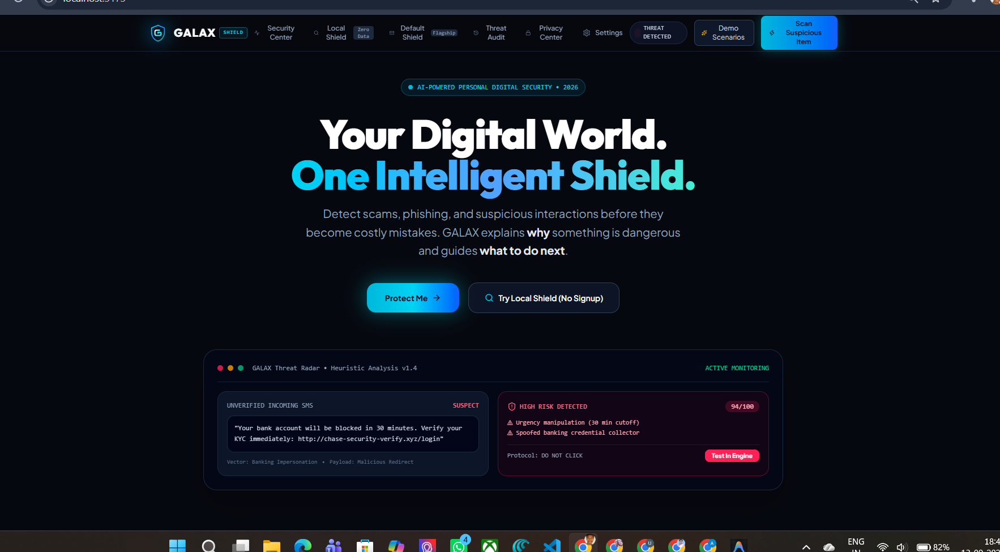
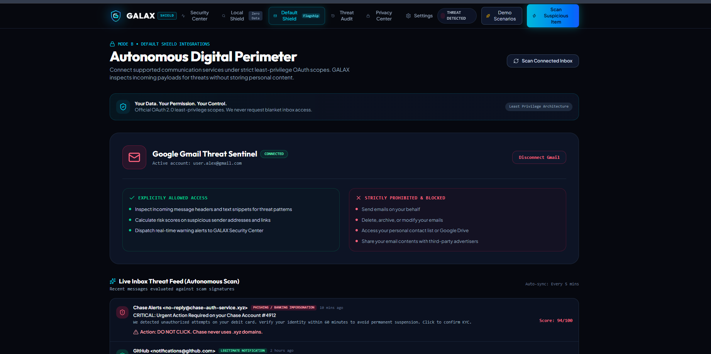
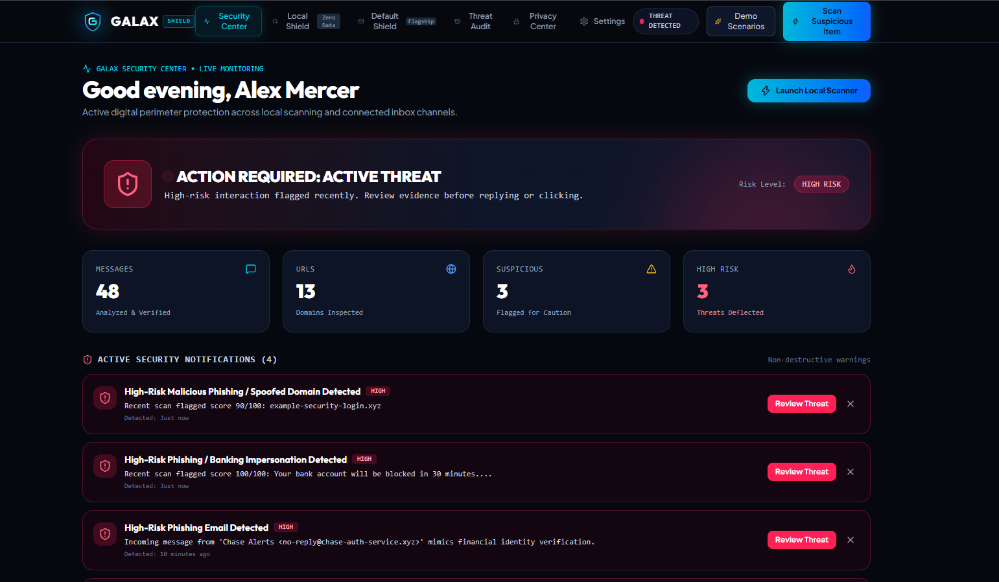

# 🛡️ GALAX — AI-Powered Personal Digital Shield

> **Detect. Explain. Protect.**

GALAX is a privacy-first AI-powered digital security platform designed to help users detect scams, fraud, phishing, suspicious links, impersonation, and other digital threats before they become costly mistakes.

## 🚀 Vision

GALAX aims to become a personal AI security layer for the user's digital life.

The core protection cycle is:

**Detect → Analyze → Explain → Warn → Protect**

## 🛡️ Protection Modes

### 🔍 Local Shield

Analyze suspicious content manually without connecting external accounts.

Users can analyze:

- 📧 Emails
- 💬 Messages
- 🔗 URLs
- 📷 Screenshots
- 💰 Payment requests
- 📄 Documents

No external account connection is required.

### 🛡️ Default Shield

The long-term protection mode allows users to connect supported services using explicit permissions and least-privilege access.

Potential integrations include:

- Gmail
- Browser
- Supported messaging services
- Cloud services
- Other supported platforms

> **Your Data. Your Permission. Your Control.**

## 🧠 Threat Detection

GALAX evaluates multiple security signals, including:

- Phishing indicators
- Urgency and manipulation
- Financial requests
- Credential requests
- Impersonation
- Suspicious URLs
- Social engineering
- Scam patterns
- Suspicious attachments
- Domain characteristics

GALAX combines these signals to generate an AI-assisted risk assessment.

## 📊 Risk Assessment

| Score | Risk Level |
|---|---|
| 0–29 | 🟢 Low Risk |
| 30–59 | 🟡 Caution |
| 60–79 | 🟠 Suspicious |
| 80–100 | 🔴 High Risk |

The score represents an AI-assisted risk assessment and is **not a guarantee that an item is fraudulent**.

## 🔎 Explainable Detection

GALAX doesn't simply say:

> "This is a scam."

Instead, it explains:

- Why the content was flagged
- Which signals were detected
- What type of threat may be involved
- How serious the risk appears
- What the user should do next

## 🖥️ Current Prototype

The current GALAX prototype includes:

- 🏠 Premium landing page
- 🛡️ Security Center
- 🔍 Local Shield
- 🛡️ Default Shield interface
- 🚨 Threat Audit
- 🔐 Privacy Center
- ⚙️ Settings
- 📊 Security statistics
- 🚨 Threat notifications
- 🧪 Demo scenarios
- 🔎 Suspicious item scanner
- 📈 Risk scoring interface
- 🔌 Integration architecture

## 📸 Screenshots

### GALAX Home



### GALAX Default Shield



### GALAX Security Center



## 🏗️ Architecture

```text
                         GALAX
                           │
              ┌────────────┴────────────┐
              │                         │
        🔍 LOCAL SHIELD            🛡️ DEFAULT SHIELD
              │                         │
              │                  Connected Services
              │                         │
              │             ┌───────────┼───────────┐
              │             ↓           ↓           ↓
              │           Gmail      Browser      Other
              │             │           │
              └─────────────┴───────────┘
                            ↓
                    GALAX AI ENGINE
                            ↓
                    Threat Analysis
                            ↓
                       Risk Engine
                            ↓
                  ┌─────────┴─────────┐
                  ↓                   ↓
              Risk Score          Explanation
                  ↓                   ↓
                  └─────────┬─────────┘
                            ↓
                       User Alert
                            ↓
                         Protect
